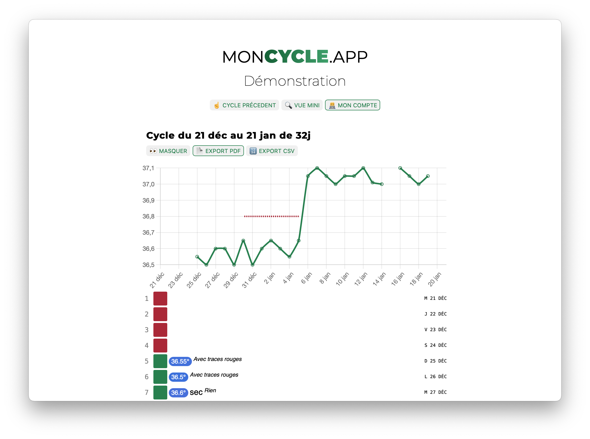

<!--
N.B.: This README was automatically generated by https://github.com/YunoHost/apps/tree/master/tools/readme_generator
It shall NOT be edited by hand.
-->

# Moncycle for YunoHost

[](https://dash.yunohost.org/appci/app/moncycle)  

[](https://install-app.yunohost.org/?app=moncycle)

*[Lire ce readme en français.](./README_fr.md)*

> *This package allows you to install Moncycle quickly and simply on a YunoHost server.
If you don't have YunoHost, please consult [the guide](https://yunohost.org/#/install) to learn how to install it.*

## Overview

Make it easy to monitor menstrual cycles and apply natural methods. Billings. Symptothermy. FertilityCare

### Features:

- a menstrual cycle tracking chart
- dedicated to natural methods
- monitoring the evolution of cervical mucus
- body temperature tracking (optional)
- FertilityCare rating (optional)
- simple on phone as on PC
- aesthetic visual with dark mode
- open source code
- no pseudo predictive intelligence
- PDF/CSV export for your instructors
- finished Excel or Google Sheets
- the same account on several devices
- automatic sending of cycles by email
- no data sales/no advertising
**Shipped version:** 11.0.2~ynh1

**Demo:** <https://tableau.moncycle.app/connexion.php?email1=demo.bill@moncycle.app&mdp=demo>

## Screenshots



## Documentation and resources

- Official app website: <https://moncycle.app>
- Upstream app code repository: <https://github.com/jean-io/moncycle.app>
- YunoHost Store: <https://apps.yunohost.org/app/moncycle>
- Report a bug: <https://github.com/YunoHost-Apps/moncycle_ynh/issues>

## Developer info

Please send your pull request to the [testing branch](https://github.com/YunoHost-Apps/moncycle_ynh/tree/testing).

To try the testing branch, please proceed like that.

``` bash
sudo yunohost app install https://github.com/YunoHost-Apps/moncycle_ynh/tree/testing --debug
or
sudo yunohost app upgrade moncycle -u https://github.com/YunoHost-Apps/moncycle_ynh/tree/testing --debug
```

**More info regarding app packaging:** <https://yunohost.org/packaging_apps>
